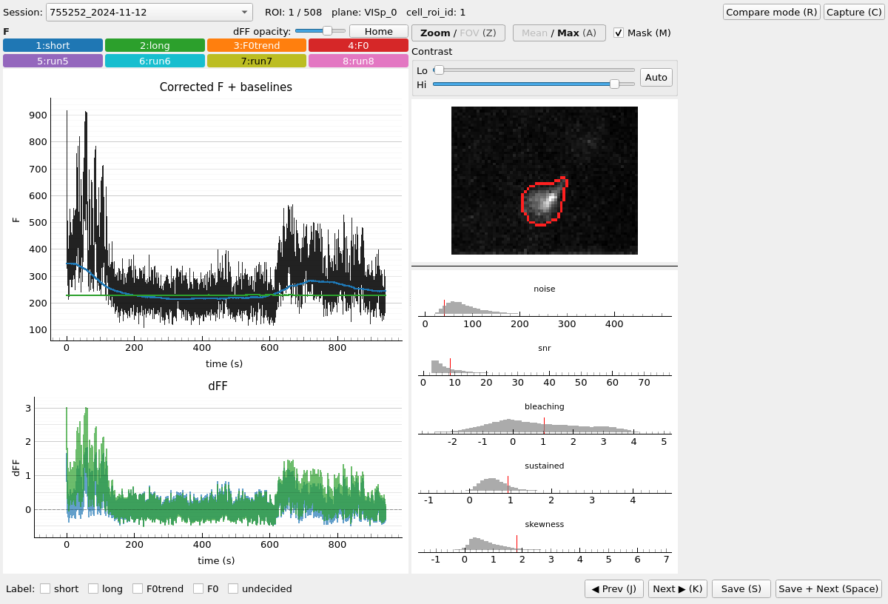
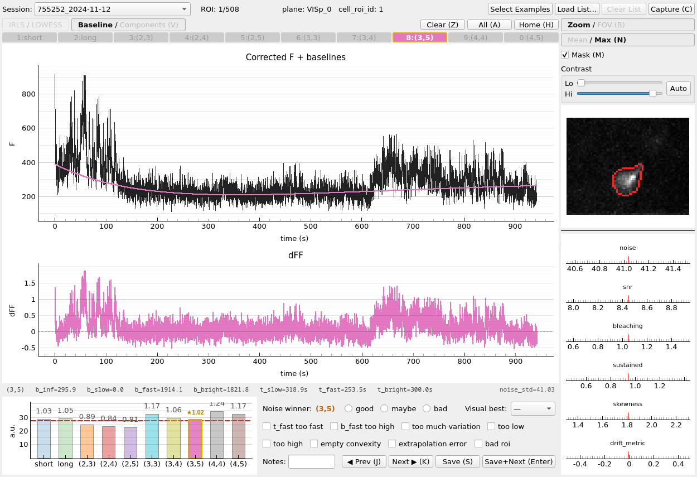
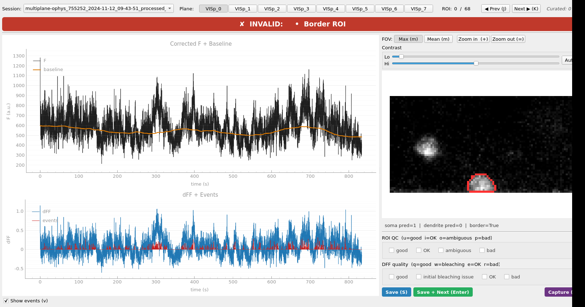

# dFF Baseline Search App

One folder for **running baseline fits** and **curating them**. Four console commands:

| Command | Purpose |
|---------|---------|
| `dff-qc-explore` | Browse baseline fits across runs; label the best choice per ROI |
| `dff-qc-detailed` | Inspect (c_pos, c_neg) noise-criterion winner per ROI across 8 combos |
| `dff-qc-production` | QC production pipeline dFF output (h5 files) |
| `dff-fit` | Run a baseline fit from a recipe JSON |

## Install

```bash
pip install -e /dff_baseline_search_qc_app
```

---

## dff-qc-explore

Browse corrected-F and dFF traces for each ROI, with up to 8 baseline overlays (short window, long window, F0trend, F0, plus up to 4 extra run slots). Label the best baseline choice. Optionally compare multiple numbered run folders side-by-side.

```bash
dff-qc-explore
```

A folder picker appears — select the **inputs folder** (the one containing per-session subfolders with `F_all_array.npy`). Its parent is automatically scanned for numbered run folders.

**Keyboard shortcuts:** `J`/`K` prev/next ROI · `1`–`8` toggle traces · `S` save · `Space` save+next · `R` toggle compare panel · `M` mask · `Z` zoom/FOV · `C` capture



### Expected data layout

```
<runs_root>/
    index.csv
    0001_first_try/          ← numbered run folders (optional, for compare)
    0002_cpos3_cneg3/
    first_try/               ← pick THIS as the inputs folder
        755252_2024-11-12/
            F_all_array.npy
            timestamps.npy
            baseline_short_window_all_array.npy
            baseline_long_window_all_array.npy
            F0trend_all.npy
            F0_all.npy
            F_noise.npy  F_snr.npy  F_skewness.npy
            bleaching_metric.npy  sustained_metric.npy
            <plane_id>_mean_img.npy
            <plane_id>_max_img.npy
            <plane_id>_roi_table.pkl
```

Output: `curation.csv` in the inputs folder (or `~/dff_baseline_qc_curation.csv` if read-only).

---

## dff-qc-detailed

For each ROI, shows the noise-criterion bar chart comparing all 8 (c_pos, c_neg) combinations. The winner (combo whose `|median(negative residuals)|` is closest to `0.674 σ_noise`) is highlighted in gold. Toggle `V` to decompose the trend into components (b_inf, b_slow, b_fast, b_bright).

```bash
dff-qc-detailed
# or with explicit paths:
dff-qc-detailed --runs_dir /path/to/runs_root --output /path/to/curation.csv
# with a pre-selected ROI list:
dff-qc-detailed --runs_dir /path/to/runs_root --roi_list /path/to/roi_list.csv
```

The `--runs_dir` must contain 8 numbered run folders (one per combo). If omitted, a folder picker appears.

**Keyboard shortcuts:** `J`/`K` prev/next · `1`–`9`,`0` toggle traces · `V` components view · `Z` clear · `A` all · `H` home · `S` save · `Enter` save+next · `C` capture



**ROI list mode:** pass `--roi_list roi_list.csv` (columns: `session_key`, `roi_index`) to restrict navigation to a specific set of ROIs. `Enter`/`Space` walks the list; `J`/`K` still navigate per-session.

Output: `binit0_qc_curation.csv` in the runs root (or path from `--output`), with columns: `noise_winner`, `visual_best`, `verdict`, `flag_*`, `notes`.

---

## dff-qc-production

QC the output of the production dFF pipeline. Loads neuropil-corrected F, pre-computed baseline and dFF, and OASIS events from h5 files. Shows ROI classification (soma/dendrite/border) and lets you mark dFF quality and QC label per ROI.

```bash
dff-qc-production
```

Auto-discovers all `multiplane-ophys_*_processed_*` session folders under `/root/capsule/data`. No arguments needed.

**Keyboard shortcuts:** `J`/`K` prev/next · `S` save · `Space` save+next · `C` capture



Output: `production_qc_curation.csv` with columns: `session`, `plane_id`, `roi_index`, `dff_quality`, `qc_label`.

---

## dff-fit

Run a recipe-driven baseline fit over one or more sessions. Outputs numbered run folders with `F0trend_all.npy`, `F0_all.npy`, residuals, and metadata.

```bash
dff-fit \
    --recipe baseline_search/recipes/first_try.json \
    --inputs_dir /results/runs/first_try \
    --out /results/runs \
    --slug my_run_name \
    --sessions 755252_2024-11-12 755252_2024-11-19
```

`--sessions` is comma-separated. Omit to process all sessions in `--inputs_dir`. Outputs land in `/results/runs/0001_my_run_name/` (auto-numbered) and a row is appended to `/results/runs/index.csv`.

**All options:**

| Flag | Default | Description |
|------|---------|-------------|
| `--recipe` | *(required)* | Path to recipe JSON |
| `--inputs_dir` | `/root/capsule/scratch/first_try` | Folder with per-session subfolders |
| `--out` | `/root/capsule/scratch/runs` | Parent for numbered output folders |
| `--slug` | *(required)* | Short name appended to run folder |
| `--sessions` | *(required)* | Comma-separated session keys to fit |
| `--n_jobs` | `-1` (all cores) | joblib parallelism |
| `--description` | `""` | Written to `metadata.json` |

**Available recipes** in `baseline_search/recipes/`:

| File | c_pos | c_neg | fluctuations |
|------|-------|-------|--------------|
| `first_try.json` | 2 | 3 | lowess |
| `cpos2_cneg4_lowess.json` | 2 | 4 | lowess |
| `cpos2_cneg5_lowess.json` | 2 | 5 | lowess |
| `cpos3_cneg3_lowess.json` | 3 | 3 | lowess |
| `cpos3_cneg4_lowess.json` | 3 | 4 | lowess |
| `cpos3_cneg5_lowess.json` | 3 | 5 | lowess |
| `cpos4_cneg4_lowess.json` | 4 | 4 | lowess |
| `cpos4_cneg5_lowess.json` | 4 | 5 | lowess |
| `percentile_variant.json` | 3 | 3 | percentile |
